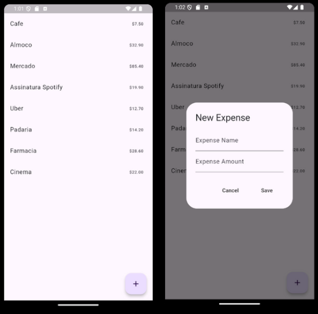

# 📱 Minimal Expense Tracker


## 📝 Descrição

Aplicativo simples para controle de despesas, focado em uma interface minimalista e intuitiva.  
Este projeto tem como objetivo praticar o uso de persistência local, gerenciamento de estado com **Provider** e construção de UI organizada e limpa.

## 🎥 Demonstração



## ⚙️ Funcionalidades

* Adicionar novas despesas
* Visualizar lista de gastos registrados
* Exibir total de despesas atualizado dinamicamente

> Observação: Projeto sem backend. Persistência é local utilizando banco de dados Isar.

## 🧠 Tecnologias

* **Flutter** 3.x  
* **Dart**  
* **Isar Database** (persistência local)  
* **intl** (formatação de valores e datas)  
* **Provider** (gerenciamento de estado)

## 🚀 Como executar

1. Clone este repositório

   ```bash
   git clone https://github.com/SeuUsuario/minimal_expense_tracker.git

2. Acesse a pasta do projeto

   ```bash
   cd minimal_expense_tracker
   ```

3. Instale as dependências

   ```bash
   flutter pub get
   ```

4. Execute o projeto

   ```bash
   flutter run
   ```

## 📝 Licença

Este projeto é de uso livre para fins educacionais e estudo.

## 📚 Créditos

Projeto baseado no tutorial:
[https://www.youtube.com/watch?v=ULupDyOgcJg](https://www.youtube.com/watch?v=ULupDyOgcJg)


